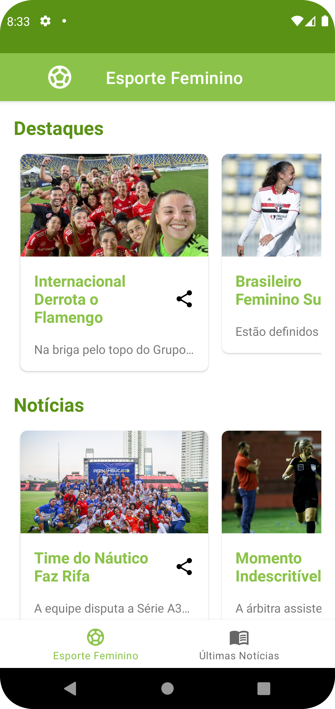
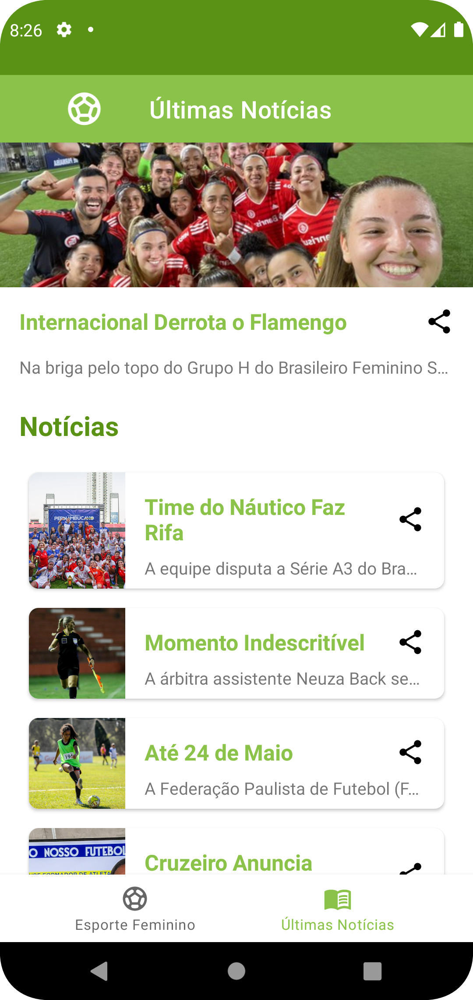
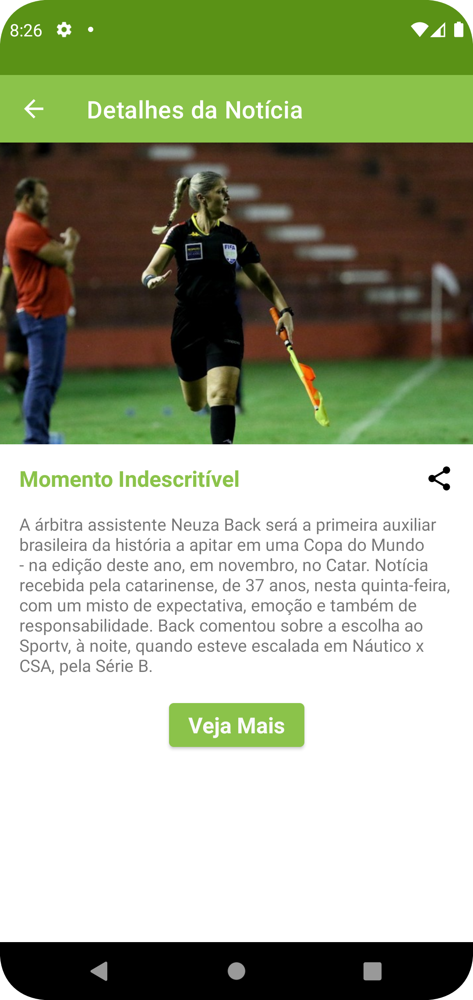

# Notícias do Futebol Feminino 
## App Android

### I. Sobre

#### Aplicativo Android feito para colocar em prática todo o aprendizado estudado nas aulas da Digital Innovation One, sendo aplicado em Java, uma Linguagem de Programação muito utilizada no mundo.

#### Aplicativo com o objetivo de ler dados de uma API e mostrar de forma visual suas informações e ações.

#### O aplicativo foi desenvolvido com a IDE Android Studio; utiliza ferramentas, como o Picasso que faz a leitura das imagens através da url e também o Retrofit para interagir com os dados da API de forma fácil de compreender.

### II. Layout do Projeto

<table>
    <tr width="100%">
        <td></td>
        <td></td>
        <td></td>
    </tr> 
</table>

### III. Tecnologias Utilizadas

* #### Java
* #### Retrofit
* #### Picasso

### IV. Autor

#### Katarine Albuquerque
#### Linkedin: <a href="https://www.linkedin.com/in/katarine-albuquerque/">/katarine-albuquerque</a>
